# **Advanced Lane Finding Project**

**The goals / steps of this project are the following:**

\* Compute the camera calibration matrix and distortion coefficients given a set of chessboard images.

\* Apply a distortion correction to raw images.

\* Use color transforms, gradients, etc., to create a thresholded binary image.

\* Apply a perspective transform to rectify binary image (&quot;birds-eye view&quot;).

\* Detect lane pixels and fit to find the lane boundary.

\* Determine the curvature of the lane and vehicle position with respect to center.

\* Warp the detected lane boundaries back onto the original image.

\* Output visual display of the lane boundaries and numerical estimation of lane curvature and vehicle position.

**Project References**

- ./test\_images\_output/calibration1.jpg Distortion corrected image
- ./test\_images\_output/sobel\_x.jpg Sobel gradient in x direction
- ./test\_images\_output/sobel\_y.jpg Sobel gradient in y direction
- ./test\_images\_output/Maginitude\_threshold.jpg magnitude threshold
- ./test\_images\_output/directional\_threshold.png directional gradient
- ./test\_images\_output/s\_channel.jpg Thresholded in s channel in an HLS image
- ./test\_images\_output/combined.jpg Gradients combined
- ./test\_images\_output/histogram.jpg Histogram for the test1.jpg
- ./test\_images\_output/Lane\_detected.jpg Final image in the project with lane line detected
- project\_video\_result.mp4 Result video after the lane detection

**Project Write up**

**Rubric Points**

**Camera Calibration –** created a function which accepts all the chess board images and creates a list of images points. Used the cv2.calibrate function to compute the calibration matrices

 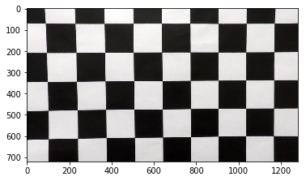
 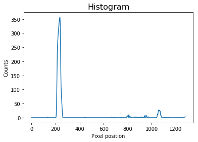

Used the cv2.undistort to un distort the image

Gradient Calculation:

Computed all the different gradients using the sobel and color thresholding and combined all the images using the function Final\_Threshold Funtion

 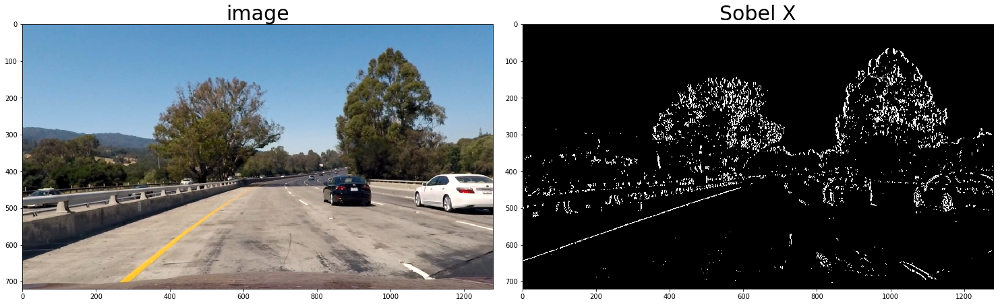
 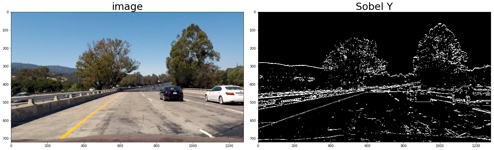
 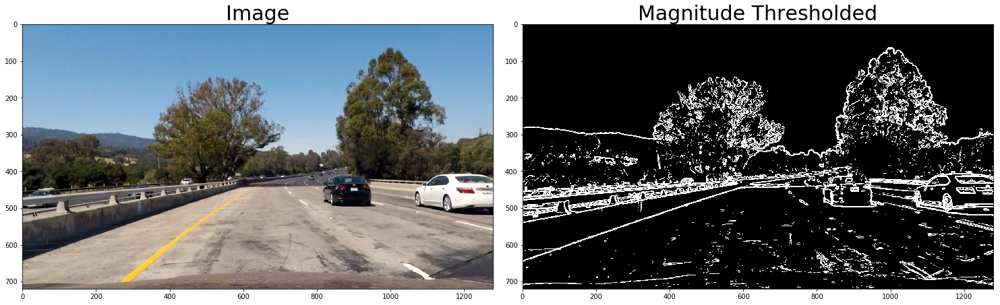
 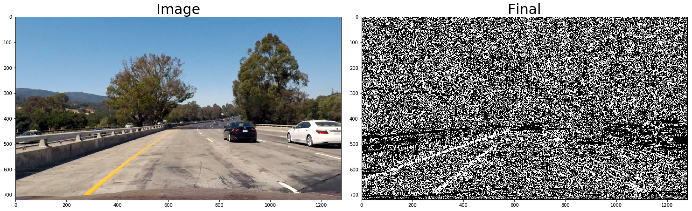
 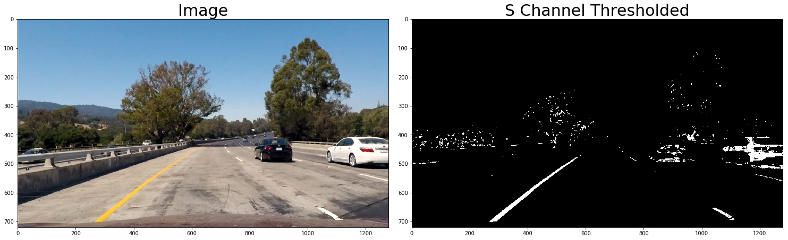
 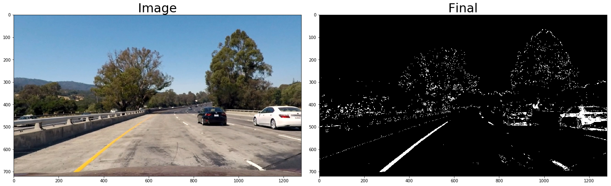

**Perspective Transform:**

Used the function from the quiz in the lesson to calculate the source and destination points

src\_coordinates = np.float32(

    [[280,  700],

     [540,  480],

     [760,  480],

     [1125, 700]])

dst\_coordinates = np.float32(

    [[250,  720],

     [250,    0],

     [1065,   0],

                [1065, 720]])

 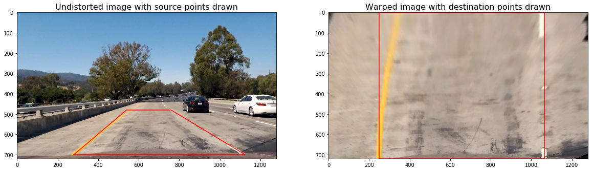

**Sliding window  algorithm:**

Used the sliding window algorithm from the quiz

 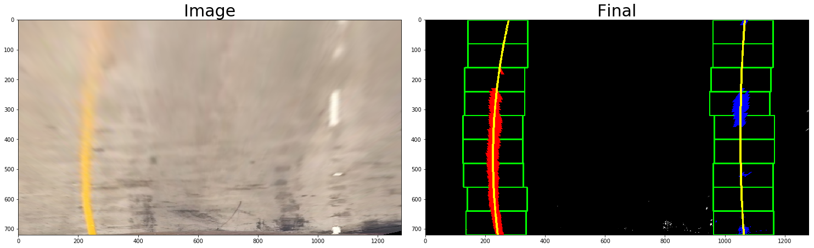

**Final lane detected:**

We calculated the lane curvature and points to mark the lanes and plotted the same back to the image

 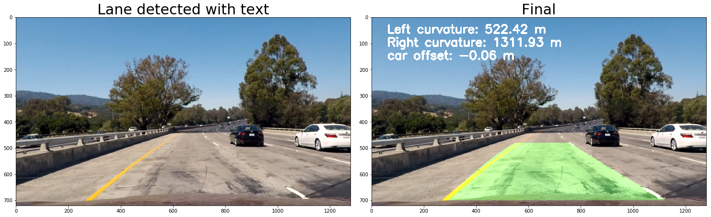

**Discussion:**

The whole algorithm takes a lot of time to calculate over the video the algorithm needs to be improved to run faster and my algorithm has a lot of error at sharp curves and when there is a lot of lighting on the road